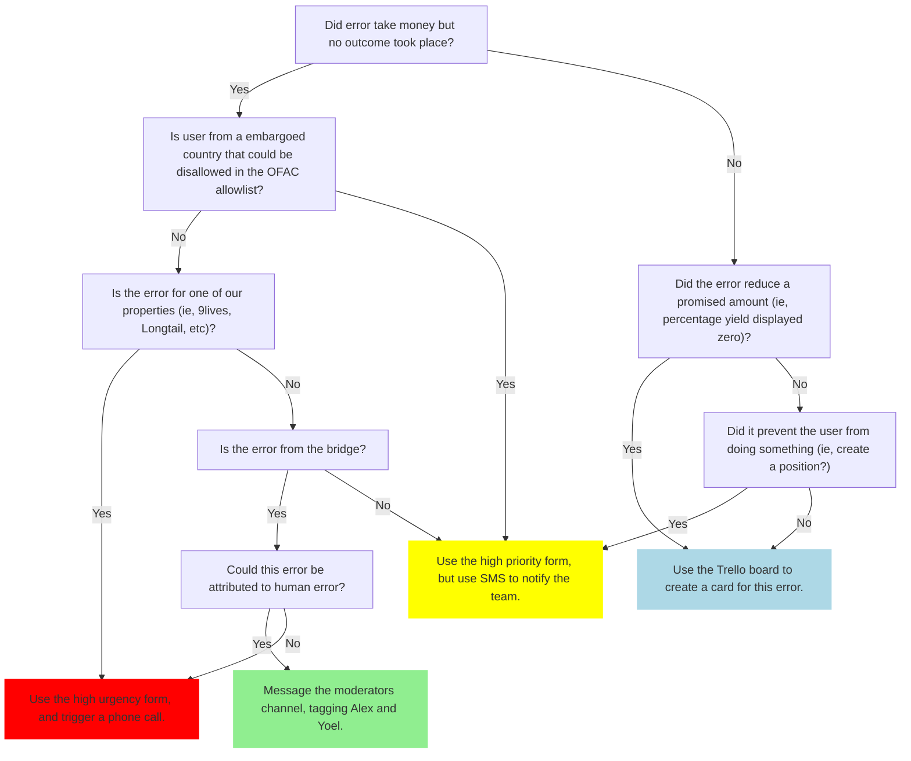

# Escalation Policy

```mermaid
flowchart TD
  style UseHighUrgencyFormEnableCall fill:red,stroke:red,stroke-width:4px,bold
  style UseHighUrgencyFormSMSOnly fill:yellow,stroke:yellow,stroke-width:4px,bold
  style UseTrello fill:lightblue,stroke:lightblue,stroke-width:4px,bold
  style MessageModeratorsChannel fill:lightgreen,stroke:lightgreen,stroke-width:4px,bold

  DidErrorTakeMoney[Did error take money but no outcome took place?] -->
  |Yes| IsUserEmbargoed[Is user from a embargoed country that could be disallowed in the OFAC allowlist?] -->
  |No| IsErrorForOneOfOurs["Is the error for one of our properties (ie, 9lives, Longtail, etc)?"] -->
  |Yes| UseHighUrgencyFormEnableCall[Use the high urgency form, and trigger a phone call.]

  IsUserEmbargoed -->|Yes| UseHighUrgencyFormSMSOnly[Use the high priority form, but use SMS to notify the team.]

  IsErrorForOneOfOurs -->|No| IsErrorForBridge[Is the error from the bridge?]
  --> |Yes| CouldErrorBeReasonablyAttributedToHumanErrorBridge[Could this error be attributed to human error?]
  --> |Yes| MessageModeratorsChannel[Message the moderators channel, tagging Alex and Yoel.]
  IsErrorForBridge -->|No| UseHighUrgencyFormSMSOnly

  CouldErrorBeReasonablyAttributedToHumanErrorBridge -->|No| UseHighUrgencyFormEnableCall

  DidErrorTakeMoney -->
  |No| DidErrorReducePromisedAmount["Did the error reduce a promised amount (ie, percentage yield displayed zero)?"] -->
  |Yes| UseTrello[Use the Trello board to create a card for this error.]

  DidErrorReducePromisedAmount -->
  |No| DidItPreventTheAction["Did it prevent the user from doing something (ie, create a position?)"] -->
  |Yes| UseHighUrgencyFormSMSOnly
  DidItPreventTheAction -->|No| UseTrello
```
